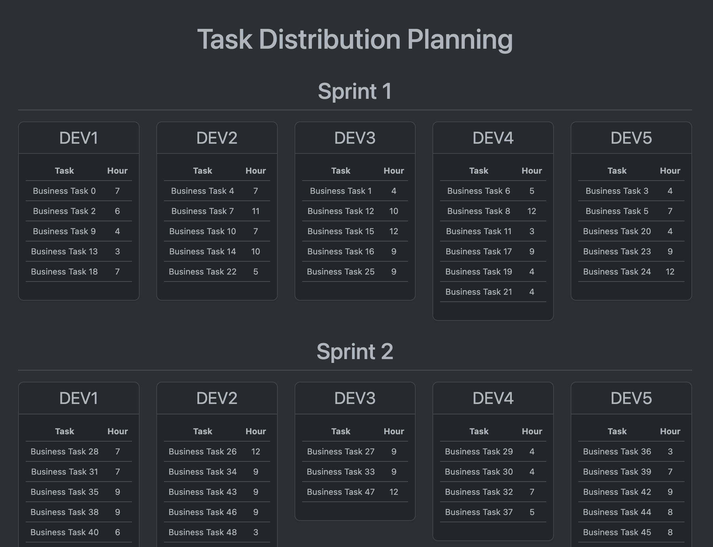

## Task Distribution Case

Task distribution according to difficulty level

### Setup:
- `git clone https://github.com/bsevgin/task-distribution.git`
- `cd task-distribution`
- `composer install`
- `cp .env.example .env`
- `php artisan key:generate`
- `./vendor/bin/sail up -d`
- open terminal in docker containter (task-distribution-laravel.test-1)
- `php artisan migrate`
- `php artisan db:seed`
- `php artisan app:get-tasks`
- open in browser http://localhost/

### Phpmyadmin
- http://localhost:8001
- username: root
- password: (no password)

## SS

